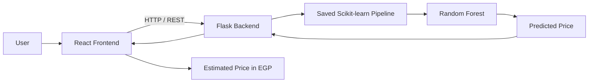

# 🏠 Egyptian House Price Predictor

<p align="center">
  <b>Machine Learning • React • Flask • REST API</b><br>
  Estimate Egyptian property listing prices from real-world data.
</p>

<p align="center">
  
  
  
  
  
</p>

---

## 🌐 Project Links

- 🚀 **[Live App](https://egyptian-house-predictor.vercel.app/)**
- 📓 **[ML Notebook](backend/house_price.ipynb)** — Data cleaning, EDA, model training & evaluation
- 📊 **[Dataset — Egyptian Real Estate Listings](https://www.kaggle.com/datasets/hassankhaled21/egyptian-real-estate-listings)**

---

## 📸 App Preview


A simple web application where the user selects the **city** and **property type**, enters the **area, bedrooms, and bathrooms**, then receives an estimated listing price in **EGP**.

---

## 🎯 Project Overview

This project turns raw Egyptian real-estate listings into a working Machine Learning web application.

```text
Raw Data
   ↓
Data Cleaning & EDA
   ↓
Feature Selection
   ↓
Model Training & Evaluation
   ↓
Saved ML Pipeline
   ↓
Flask REST API
   ↓
React Web App
   ↓
Estimated Listing Price
```

### Main Features

- 🏙️ City selection
- 🏢 Property type selection
- 📐 Area in square meters
- 🛏️ Bedrooms
- 🛁 Bathrooms
- 🤖 Random Forest price prediction
- ✅ Input validation
- 🔄 React ↔ Flask REST API
- 💾 Saved preprocessing + model pipeline
- 📱 Clean and responsive interface

---

## 📊 Dataset

The project uses the **Egyptian Real Estate Listings** dataset from Kaggle.

After removing listings without a target price, the dataset contained **11,441 records**.

### Target

```text
price
```

### Final Prediction Features

```text
city
type
size_sqm
bedrooms
bathrooms
```

---

## 🧹 Data Cleaning

The original dataset contained several text-based and inconsistent fields.

- Converted `price` from text to numeric.
- Extracted numeric area from values such as `"Delivery in 2025 / 150 sqm"`.
- Converted `"3 Bedrooms"` into a numeric bedroom value.
- Converted bathrooms to numeric values.
- Parsed `available_from` into year/month/day features.
- Removed unused columns such as `url`, `down_payment`, and `down_payment_amount`.
- Handled missing bedroom and bathroom values.
- Checked for duplicate records.

**Duplicate rows:** `0`

---

# 📈 Exploratory Data Analysis

### 1. Price Distribution


The price distribution is strongly **right-skewed**, with most listings concentrated at lower prices and fewer high-priced properties.

### 2. Correlation Matrix


Some notable relationships:

- Bedrooms ↔ Bathrooms: **0.77**
- Bedrooms ↔ Price: **0.51**
- Bathrooms ↔ Price: **0.49**

The analysis also revealed an unexpected issue with the extracted `size_sqm` values, which was investigated during data cleaning.

### 3. Price vs Size


This visualization was used to inspect the relationship between property size and listing price and to identify unusual values.

### 4. Average Price by City


Location has a clear effect on average listing prices. The chart shows the average prices for the top 10 most common cities/locations in the dataset.

### 5. Average Price by Property Type


Property type also has a strong effect on listing price, with noticeable differences between residential categories.

---

## 🤖 Machine Learning

This is a **Regression** problem.

Two models were compared:

| Model | MAE | R² |
|---|---:|---:|
| Linear Regression | 8,651,757 EGP | 0.31 |
| **Random Forest** | **5,493,875 EGP** | **0.66** |

### 🏆 Final Model

**Random Forest Regressor** was selected because it achieved the lower MAE and higher R².

The final pipeline uses:

```text
city + type
      ↓
OneHotEncoder
      ↓
Numerical Features
      ↓
Random Forest Regressor
      ↓
Estimated Price
```

The complete trained pipeline is saved as:

```text
backend/house_price_model.pkl
```

This keeps preprocessing and prediction together, so the same transformations used during training are applied when the API receives new data.

---

# ⚙️ Application Architecture



### Prediction Request

```json
{
  "city": "Cairo",
  "type": "Apartment",
  "size_sqm": 150,
  "bedrooms": 3,
  "bathrooms": 2
}
```

### API Response

```json
{
  "predicted_price": 1234567.89,
  "currency": "EGP"
}
```

The number above is only an example of the response format.

---

## 🔌 API

| Method | Endpoint | Purpose |
|---|---|---|
| `GET` | `/api/health` | Check API status |
| `GET` | `/api/options` | Get available cities & property types |
| `POST` | `/api/predict` | Generate a price prediction |

The backend validates required fields, categories, numeric values, and reasonable input ranges before making a prediction.

The `/api/options` endpoint reads city and property-type categories directly from the fitted `OneHotEncoder`, keeping the **saved model as the source of truth** instead of hardcoding options in the frontend.

---

## 🧪 Testing

The application was designed to handle:

- Small, medium, and large properties
- Missing fields
- Invalid city/property type
- Non-numeric values
- Negative or unrealistic values

Invalid requests return clear API errors instead of crashing the application.

---

## 🛠️ Tech Stack

**Machine Learning**
- Python
- Pandas
- Scikit-learn
- Random Forest
- Joblib

**Backend**
- Flask
- Flask-CORS
- REST API
- Gunicorn

**Frontend**
- React
- Vite
- JavaScript
- CSS

**Deployment**
- Render
- Docker

---

## 📁 Project Structure

```text
egyptian-house-predictor/
│
├── backend/
│   ├── app.py
│   ├── house_price_model.pkl
│   ├── house_price.ipynb
│   ├── requirements.txt
│   └── photos/
│       ├── App Preview Egyptian House Price.png
│       ├── Distribution of House Prices.jpeg
│       ├── Correlation Matrix.jpeg
│       ├── Price vs Size.jpeg
│       ├── Average Price by City (Top 10 most common).jpeg
│       └── Average Price by Property Type.jpeg
│
├── frontend/
│   ├── src/
│   ├── public/
│   └── package.json
│
├── Dockerfile
├── render.yaml
└── README.md
```

---

## ▶️ Run Locally

### Backend

```bash
cd backend
pip install -r requirements.txt
python app.py
```

Backend:

```text
http://localhost:5000
```

### Frontend

```bash
cd frontend
npm install
npm run dev
```

The React application communicates with the Flask API through:

```text
http://localhost:5000/api
```

---

## 🤖 AI & Vibe Coding

AI tools were used as a development accelerator for parts of the frontend, backend, debugging, API integration, and deployment setup.

The ML workflow, preprocessing, model comparison, API flow, and validation were reviewed and understood as part of the project.

> **Use AI to build faster — but understand what you build.**

---

## 💡 Key Takeaways

This project helped me understand how to move from:

**Raw Data → Machine Learning → Saved Model → API → Real Web Application**

The biggest lesson was that **data quality and preprocessing are just as important as choosing the ML model.**

---

## ⚠️ Disclaimer

This application estimates **property listing prices** from historical real-estate listings. It is an educational project and should not be considered an official property valuation or guaranteed market price.
